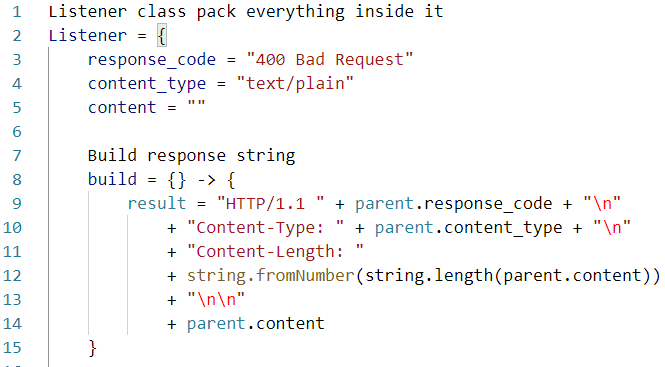

# escript-highlighter README

This is the README for your extension "escript-highlighter". After writing up a brief description, we recommend including the following sections.

## Features

## Requirements

## Extension Settings

Include if your extension adds any VS Code settings through the `contributes.configuration` extension point.

For example:

This extension contributes the following settings:

- `myExtension.enable`: enable/disable this extension
- `myExtension.thing`: set to `blah` to do something

## Known Issues

## Release Notes

### 0.0.1

Initial release of escript-highlighter

---

## Working with Markdown

### For more information

- [escript runtime](https://github.com/e-script/escript/)
- [escript highlighter](https://github.com/e-script/escript-highlighter/)

**Enjoy!**
